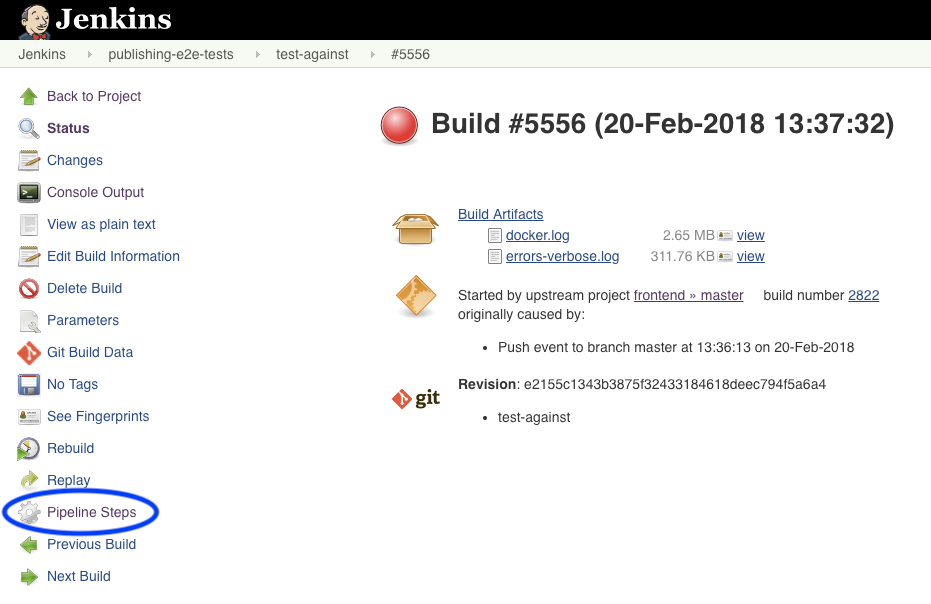

# Debugging Jenkins failures

## Using the JUnit test results

The easiest way to get an overview of test output is to view the Test Result
file created after the tests are complete - there are links to it on the build
summary.


### Screenshots

For each test failure there will be a corresponding screenshot of what PhantomJS
was seeing at the time the test failed.  This can be a useful resource when
Poltergeist complains about being unable to see or click on a link.


## Using the pipeline steps view

If there aren’t test results available, then the error will likely have occurred
during the setup before the apps have run.  The “Pipeline Steps” give a more
detailed breakdown of which steps failed.



From there, click on the console button to the left of any red error step to
view related console output at that time which will explain the error.


## Using the errors log

When an error occurs in one of the Ruby microservices, but detailed information
isn’t displayed in the console output you can dig into one of the two error
logs.

The abridged version of the log file which displays brief exception details
is dumped into the full console output as part of the build script.  The full
console output can be accessed from “Console output” > “Full Log”.  Scroll
through the output until you see the distinctive Ruby symbolized output.

```console
13:48:18 ---
13:48:18 :timestamp: 2018-02-20 13:47:24.348153233 +00:00
13:48:18 :errors:
13:48:18 - :type: GovukIndex::InvalidFormatError
13:48:18   :message: GovukIndex::InvalidFormatError
13:48:18 :context:
13:48:18   :environment: rummager-worker
13:48:18   :hostname:
13:48:18   :url:
13:48:18 ---
```
Example error style to look out for in the console output.

In the rare occasions that the abridged error doesn’t have enough information
on the issue, there is also the errors-verbose.log, provided as a build
artifact. This file lists the same errors, but with full stack trace
information.

## Failures that don’t raise Ruby errors

Builds can fail from flakiness caused by the timing of inter-container
communication.  In scenarios where you can’t see an error in the full console
output or errors log the `docker.log` build artefact _MAY_ provide a useful
source of information.  The docker.log file contains all the stdout + stderr
from all the docker containers.  Ranging between 3 and 10MB, it is important you have a
clear idea of what you are looking for before jumping into it.
If you believe there is a problem with a specific service you can grep for
that service name:

    grep “publishing-api_1” docker.log

Another technique is to track the publishing events between applications for
a test by using its slug.  E.g. when finding events related to the
“Publishing with Specialist Publisher” test, it publishes the sluglified
title `"Publishing Specialist Publisher #{SecureRandom.uuid}"` →
`“publishing-specialist-publisher-uuid”`.

    grep -C 5 “publishing-specialist-publisher” docker.log
